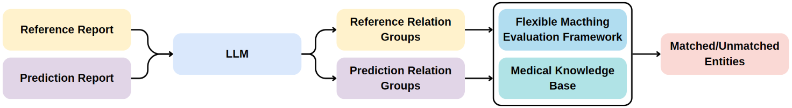
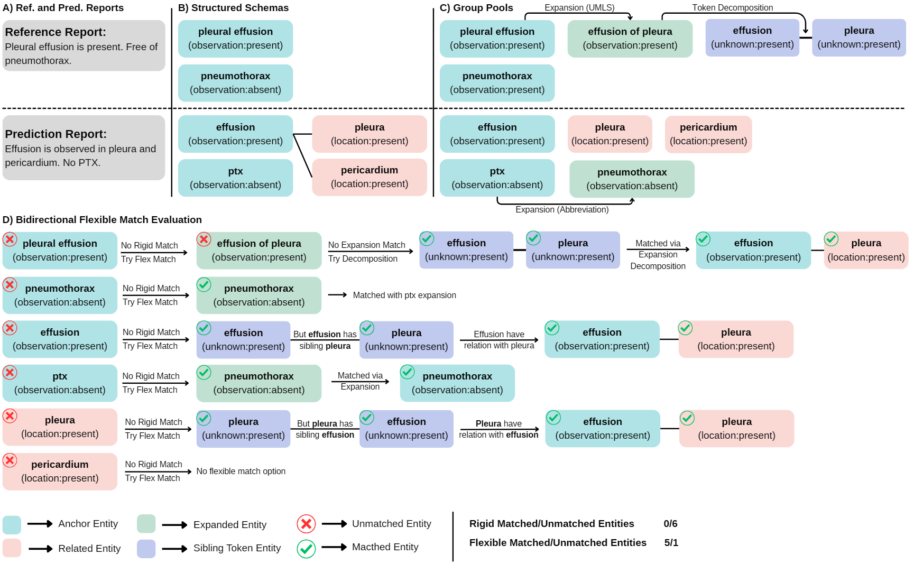

# CIFRCE

**Clinical Information-aware Flexible Radiology Report Comparison and Evaluation**

CIFRCE is a clinically informed evaluation framework for radiology reports that bridges the gap between rigid entity-based metrics and black-box LLM-based raters. Rather than relying on end-to-end LLM scoring, CIFRCE primarily transforms free-text radiology reports into structured entity–relation groups using a fine-tuned language model. These groups are then compared with a flexible bidirectional matching algorithm combining UMLS thesaurus expansion, medical abbreviation normalization, token-level decomposition, and domain-specific semantic embeddings. The result is a transparent, interpretable, and clinically meaningful evaluation that identifies matching and mismatching clinical concepts while preserving anatomical, severity, and temporal context.

## Overview





Radiology report generation models are typically evaluated with lexical overlap metrics (BLEU, ROUGE) or black‑box LLM scorers, both of which have significant drawbacks. CIFRCE offers an alternative:

1. **Extract** structured clinical information (observations, locations, degrees, trends, measurements) from both the reference and the generated report.
2. **Match** these structured representations using a flexible, knowledge‑augmented algorithm that recognises semantically equivalent expressions even when surface forms differ.
3. **Evaluate** by counting matched and unmatched entities per clinical field, providing a transparent assessment that can be used to derive scalar scores.

The framework is designed to be modular and extensible. It uses a fine‑tuned **MediPhi‑Instruct (3.8B)** model for extraction.

## Data Preparation

The framework expects radiology reports in a simple JSON format. Each entry must contain at least a `"report"` field with the free‑text report. For training and validation, you also need structured ground‑truth annotations (see below).

Example input file (`reports.json`):
```json
[
  {
    "report": "There are bilateral pleural effusions which have increased significantly in size when compared to prior study..."
  }
]
```

We used several public datasets in our experiments:

- RadGraphXL (MIMIC and Stanford subsets)
- CT‑RATE
- MIMIC‑IV (randomly selected reports)
- Radiopaedia
- ReXGradient

For fine‑tuning, you will need structured annotations (JSON relation groups). You can generate them using the DeepSeek.

## Structured Annotation Generation

We provide a script to automatically generate structured annotations using the **DeepSeek V3.2 Reasoning** model. This step is recommended if you do not have pre‑annotated data.

### Setup

1. Obtain a DeepSeek API key and set it as an environment variable:
   ```bash
   export DEEPSEEK_API_KEY="your-key-here"
   ```
2. Place your input report JSON file (e.g., `reports.json`) and the prompt template (`data/structured_annotation_generation_prompt.txt`) in the appropriate locations.

### Run annotation generation

```bash
cd data
python structured_annotation_generation.py \
    --input ../reports.json \
    --output ../annotated_reports.json \
    --prompt_file structured_annotation_generation_prompt.txt \
    --model deepseek-reasoner \
    --max_concurrent 20 \
    --max_tokens 64000
```
The script will save the annotated data with `"entities"` fields (relation groups) alongside each report.

## Fine‑tuning a Small LLM

We fine‑tune **MediPhi‑Instruct (3.8B)** with LoRA to perform the entity‑relation extraction task efficiently. The training script uses `trainer.train` and supports DeepSpeed ZeRO‑2/3.

### Training configuration

- **Base model:** `microsoft/MediPhi-Instruct`
- **LoRA:** r=16, alpha=32, dropout=0.0, target_modules = all linear layers except `lm_head` and embedding layers
- **Optimizer:** AdamW, learning rate 2e‑4, cosine scheduler, warmup ratio 0.03
- **Batch size:** per‑device = 1, gradient accumulation = 4 (effective batch size = 16 with 4 GPUs)
- **Max sequence length:** 8192
- **Epochs:** 2 (we observed validation loss increasing after the second epoch)

### Launch training

**Single GPU (debug):**
```bash
python -m trainer.train \
    --model_name_or_path microsoft/MediPhi-Instruct \
    --train_dataset_use ct_rate_train,mimic_iv_train,... \
    --val_dataset_use ct_rate_val,mimic_iv_val,... \
    --output_dir ./checkpoints \
    --lora_enable True \
    --lora_r 16 \
    --lora_alpha 32 \
    --per_device_train_batch_size 1 \
    --gradient_accumulation_steps 4 \
    --learning_rate 2e-4 \
    --num_train_epochs 2 \
    --fp16 True \
    --gradient_checkpointing True \
    --model_max_length 8192
```

**Multi‑GPU with DeepSpeed (ZeRO‑2):**
```bash
deepspeed --num_gpus=4 trainer.train \
    --deepspeed scripts/zero2.json \
    --model_name_or_path microsoft/MediPhi-Instruct \
    --train_dataset_use ... \
    ...
```

**SLURM cluster:** Use the provided script `scripts/sbatch_run_lgelcm_train.sh` (adjust paths as needed).

## Inference (Entity–Relation Extraction)

After fine‑tuning, use the `eval.inference` module to extract structured relation groups from new radiology reports.

Running `run_llm_inference.sh` script will produce a JSON file where each entry contains the original report and the predicted `"entities"` (relation groups). The output format matches the ground‑truth annotations, enabling direct evaluation.

## Flexible Evaluation Pipeline

The evaluation pipeline compares ground‑truth and predicted relation groups using the flexible matching algorithm described in the paper.

### Steps

1. **Filter test‑split entries** from the synonym lexicons to prevent data leakage across different test sets:
   ```bash
   cd flexible_evaluation_pipeline
   python filter_test_split.py \
       --entity_json entity.json \
       --entity_rule_json entity_rule.json
   ```

2. **Extract unique entities** from the inference results:
   ```bash
   python extract_unique_entities.py \
       --input_file ../results/predictions.json \
       --output_file ../results/unique_entity_counts_test.json \
       --gt_key gt_entities \
       --pred_key pred_entities
   ```

3. **Tokenize and resolve entities** using SciSpacy + UMLS linker:
   ```bash
   python tokenize_entities.py
   ```
   This builds `entity.json` and `entity_rule.json` caches.

4. **Compute embeddings and synonyms** with BioLORD‑2023‑M:
   ```bash
   python compute_embeddings.py \
       --input_file entity.json \
       --cache_file embeddings_cache.pkl \
       --synonyms_file embedding_synonyms.json \
       --model_name FremyCompany/BioLORD-2023-M \
       --similarity_threshold 0.9 \
       --batch_size 1000
   ```

5. **Run the flexible matching evaluation**:
   ```bash
   python evaluate_entity_matching.py \
       --input_json ../results/predictions.json \
       --output_json ../results/detailed_evaluation_results.json
   ```

The output JSON contains, for each report, a detailed breakdown of matched/unmatched entities per field. You can then compute error counts for correlation with human judgments.

We provide a convenience script:

```bash
bash scripts/run_flexible_evaluation.sh
```

Make sure the paths inside the script point to your actual files.

## Acknowledgments

- The training, inference, and evaluation experiments were carried out using the **TRUBA/ARF** computing resources provided by the TUBITAK ULAKBIM High Performance and Grid Computing Center.
- We thank the authors of RadGraph, ReXVal, and the open‑source models (MediPhi‑Instruct, DeepSeek, BioLORD) for making their work available.